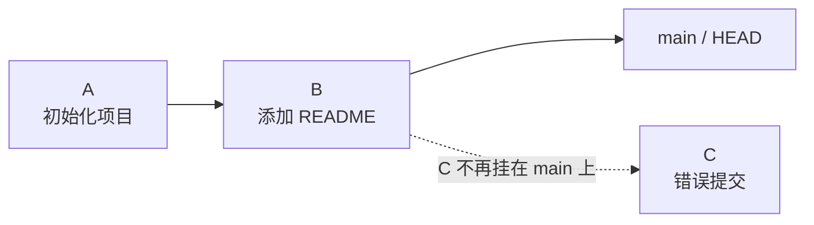

# Day 19：回退提交

## 学习目标

理解 `revert` 和 `reset` 的区别，知道什么时候应该保留历史，什么时候可以改写历史。

## 核心概念

“回退提交”其实有两种思路：

- 用一个新提交撤销旧提交：`git revert`
- 让分支指针回到旧位置：`git reset`

这两个命令都能让代码回到之前的状态，但它们对提交历史的处理完全不同。

## 场景示例

假设当前提交历史是这样：


现在发现 `C` 是错误提交，需要撤销。

这里的 `A`、`B`、`C` 只是为了方便理解。真实项目里看到的一般是类似 `9f3a2c1` 这样的 commit id。

## 方法一：使用 revert

`revert` 不会删除 `C`，而是新增一个提交 `D`，用来抵消 `C` 的改动。

```bash
git revert C
```

结果变成：


特点：

- 历史完整
- 适合已经推送到远端的提交
- 适合多人协作分支
- 别人还能看到曾经发生过错误提交，也能看到你如何撤销它

常用命令：

```bash
git log --oneline
git revert <commit-id>
```

如果 revert 时发生冲突，解决方式和合并冲突类似：

```bash
git status
# 手动编辑冲突文件
git add <file>
git revert --continue
```

如果不想继续这次 revert：

```bash
git revert --abort
```

## 方法二：使用 reset

`reset` 会移动当前分支指针。比如回到 `B`：

```bash
git reset --hard B
```

结果变成：



特点：

- 当前分支历史里看不到 `C`
- 适合还没推送到远端的本地提交
- 如果已经推送到远端，再 reset 就需要强制推送
- 多人协作时要非常谨慎

## reset 的三种常见模式

假设你刚提交了一个错误提交，想撤回到上一个提交：

```bash
git reset --soft HEAD~1
git reset --mixed HEAD~1
git reset --hard HEAD~1
```

区别如下：

| 命令 | 提交记录 | 暂存区 | 工作区 |
|---|---|---|---|
| `git reset --soft HEAD~1` | 回退 1 个提交 | 保留改动并放在暂存区 | 保留 |
| `git reset --mixed HEAD~1` | 回退 1 个提交 | 取消暂存 | 保留 |
| `git reset --hard HEAD~1` | 回退 1 个提交 | 清空 | 丢弃改动 |

可以这样记：

- `--soft`：提交没了，改动还在暂存区
- `--mixed`：提交没了，改动还在工作区
- `--hard`：提交没了，改动也没了

不写参数时，`git reset HEAD~1` 默认就是 `git reset --mixed HEAD~1`。

## 一个完整例子

假设你不小心提交了一个 `a.txt`：

```bash
echo "wrong content" > a.txt
git add a.txt
git commit -m "add wrong file"
```

此时历史可能是：


如果这个提交已经推送给别人看到了，用 `revert`：

```bash
git revert B
```

历史会变成：


如果这个提交只在你本地，还没推送，可以用 `reset`：

```bash
git reset --soft HEAD~1
```

执行后：

- `add wrong file` 这个提交没了
- `a.txt` 的改动还在暂存区
- 你可以修改后重新提交

如果你想让 `a.txt` 回到未暂存状态：

```bash
git reset --mixed HEAD~1
```

执行后：

- 提交没了
- `a.txt` 的改动还在工作区
- `git status` 会看到它是未暂存改动

如果你确定这个错误改动完全不要了：

```bash
git reset --hard HEAD~1
```

执行后：

- 提交没了
- `a.txt` 的改动也没了
- 这一步最危险，执行前要确认没有需要保留的本地修改

## 已经推到远端怎么办

如果错误提交已经推送到远端，优先用：

```bash
git revert <commit-id>
git push
```

这样不会改写远端历史。

只有在你明确知道这个分支可以改写历史时，才考虑：

```bash
git reset --hard <previous-commit>
git push --force-with-lease origin main
```

注意：

- `--force-with-lease` 比 `--force` 更稳
- 它会先检查远端有没有别人新推的提交
- 如果别人已经更新了远端，它会拒绝覆盖

## reset 后还能找回来吗

很多时候可以。Git 会用 `reflog` 记录 HEAD 最近移动过的位置：

```bash
git reflog
```

如果你刚刚 `reset --hard` 回退错了，可以先在 `reflog` 里找到回退前的 commit id，然后回到那里：

```bash
git reset --hard <old-commit-id>
```

不过不要把 `reflog` 当成永久保险。它是本地记录，会过期，也不会自动帮你恢复未提交的工作区改动。

## 推荐选择

| 场景 | 推荐命令 |
|---|---|
| 错误提交还没推送 | `git reset` |
| 错误提交已经推送 | `git revert` |
| 想保留完整历史 | `git revert` |
| 想删除本地最后一次提交并保留改动 | `git reset --soft HEAD~1` |
| 想删除本地最后一次提交和改动 | `git reset --hard HEAD~1` |
| 必须删除远端最新提交 | `git reset --hard` + `git push --force-with-lease` |

## 今日练习

1. 新增一个文件并提交，模拟错误提交。
2. 用 `git log --oneline` 找到 commit id。
3. 用 `git revert <commit-id>` 撤销它。
4. 再创建一个本地错误提交。
5. 分别尝试 `git reset --soft HEAD~1` 和 `git reset --mixed HEAD~1`，观察 `git status` 的变化。

## 检查点

你应该知道：

- `revert` 是新增提交来撤销旧提交
- `reset` 是移动分支指针
- `reset --hard` 会丢弃本地改动
- `reflog` 有机会找回刚刚回退错的提交
- 公共分支优先使用 `revert`
- 强制推送前要确认不会覆盖别人的工作
