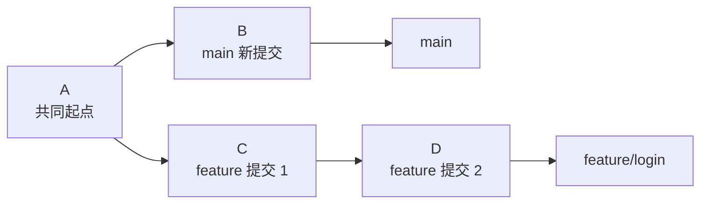
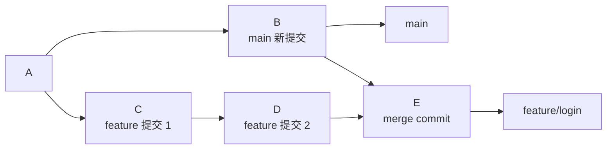
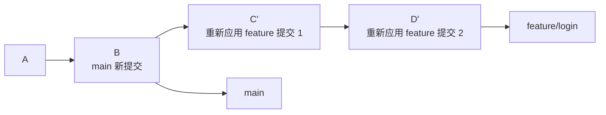

# Day 23：rebase 深入理解

## 学习目标

理解 `rebase` 不只是“更新分支”，而是把一组提交重新放到另一个起点后面。

学完今天你应该知道：

- `rebase` 和 `merge` 的区别
- `rebase` 为什么会改写提交历史
- 什么时候适合用 `rebase`
- rebase 冲突怎么处理
- `git rebase -i` 能做什么
- 已经推送到远端的分支 rebase 后为什么要谨慎

## 核心概念

`rebase` 可以拆成两个动作理解：

1. 先找到当前分支和目标分支的共同祖先。
2. 再把当前分支上独有的提交，一个一个重新应用到目标分支后面。

也就是说，rebase 不是简单移动提交，而是“重新生成一批提交”。

这也是为什么 rebase 后 commit id 会变：内容看起来可能一样，但提交的父节点变了，所以 Git 会生成新的提交对象。

## merge 和 rebase 的图示区别

假设你从 `main` 创建了 `feature/login`：



此时 `main` 和 `feature/login` 都往前走了。

### 使用 merge

如果在 `feature/login` 上执行：

```bash
git merge main
```

Git 会新增一个合并提交：



特点：

- 保留真实分叉历史
- 不改写已有提交
- 历史可能出现很多 merge commit

### 使用 rebase

如果在 `feature/login` 上执行：

```bash
git rebase main
```

Git 会把 `C`、`D` 重新放到 `B` 后面：



注意这里变成了 `C'`、`D'`，它们不是原来的 `C`、`D`，而是新提交。

特点：

- 历史更线性
- 少一些 merge commit
- 会改写当前分支上的提交历史

## 常用 rebase 场景

### 场景一：让功能分支跟上 main

这是最常见的用法：

```bash
git switch feature/login
git fetch origin
git rebase origin/main
```

含义是：把 `feature/login` 上自己的提交，重新放到最新的 `origin/main` 后面。

这样做的好处是，最后合入 main 时，历史会比较直：

```text
A---B---C---D---E
            main
                F---G
                feature/login
```

### 场景二：提交前整理自己的本地提交

比如你本地有三次提交：

```text
pick a1 修改按钮颜色
pick b2 修复按钮颜色写错
pick c3 补充登录测试
```

其中 `b2` 其实只是修正 `a1`，你不希望历史里留下“修复刚才写错”的提交。

可以用交互式 rebase：

```bash
git rebase -i HEAD~3
```

打开后可能看到：

```text
pick a1 修改按钮颜色
pick b2 修复按钮颜色写错
pick c3 补充登录测试
```

把第二行改成 `fixup`：

```text
pick a1 修改按钮颜色
fixup b2 修复按钮颜色写错
pick c3 补充登录测试
```

保存后，Git 会把 `b2` 合并进 `a1`，让历史更干净。

## 交互式 rebase 常见操作

执行：

```bash
git rebase -i HEAD~3
```

常见指令：

| 指令 | 作用 |
|---|---|
| `pick` | 保留这个提交 |
| `reword` | 保留提交内容，但修改提交信息 |
| `edit` | 停在这个提交，让你修改内容 |
| `squash` | 合并到上一个提交，并保留提交信息编辑机会 |
| `fixup` | 合并到上一个提交，丢弃当前提交信息 |
| `drop` | 删除这个提交 |

新手最常用的是：

- `reword`：改 commit message
- `squash` / `fixup`：合并零碎提交
- `drop`：删除不想要的本地提交

## rebase 冲突怎么处理

rebase 是把提交一个一个重新应用，所以冲突也可能一个一个出现。

执行：

```bash
git rebase main
```

如果发生冲突，Git 会暂停，并提示哪些文件冲突。

处理流程：

```bash
git status
# 打开冲突文件，手动解决 <<<<<<< ======= >>>>>>> 标记
git add <file>
git rebase --continue
```

如果后面还有提交也冲突，Git 会继续暂停，你重复解决即可。

如果你不想继续这次 rebase：

```bash
git rebase --abort
```

`--abort` 会尽量回到 rebase 之前的状态。

如果某个提交已经不需要了，也可以跳过：

```bash
git rebase --skip
```

但 `--skip` 要谨慎，因为它会跳过当前正在重放的提交。

## rebase 为什么不能随便用在公共分支

因为 rebase 会改写提交历史。

假设你把这个分支已经推给别人了：

```text
A---B---C  feature/login
```

别人也基于 `C` 开始开发：

```text
A---B---C---X  other-user
```

你这时 rebase 以后，`B`、`C` 可能变成新的 `B'`、`C'`：

```text
A---B'---C'  feature/login
```

对别人来说，远端历史突然变了，他本地的 `C` 和远端的 `C'` 不是同一个提交，后续 pull/push 都可能变复杂。

所以记住这条规则：

> 已经被别人基于它继续开发的分支，不要随便 rebase。

## rebase 后怎么推送远端

如果你 rebase 的只是自己的功能分支，并且这个分支只有你在用，推送时可能会遇到：

```text
non-fast-forward
```

这是因为远端还保存着旧历史，本地已经变成新历史。

这时不要直接用 `--force`，优先用：

```bash
git push --force-with-lease origin feature/login
```

`--force-with-lease` 会先检查远端有没有别人新推的提交。如果远端被别人更新过，它会拒绝覆盖。

## pull --rebase 是什么

平时你可能见过：

```bash
git pull --rebase
```

它大致等价于：

```bash
git fetch
git rebase origin/current-branch
```

它的作用是：拉取远端更新后，把你的本地提交重新放到远端最新提交后面。

适合这种情况：

- 你本地有提交
- 远端也有新提交
- 你希望历史保持线性

不适合这种情况：

- 你不清楚当前分支是不是多人共享
- 你不想改写本地提交历史
- 你正在处理复杂冲突

## rebase 和 merge 怎么选

| 场景 | 推荐 |
|---|---|
| 自己的本地功能分支，想整理历史 | `rebase` |
| 把 main 的最新内容同步到个人 feature 分支 | `rebase` |
| 多人共享分支同步代码 | `merge` |
| 想完整保留分叉和合并过程 | `merge` |
| PR 合并前整理零碎提交 | `rebase -i` |
| 不确定会不会影响别人 | 优先不用 rebase |

## 今日练习

1. 从 `main` 创建一个分支：

```bash
git switch -c feature/rebase-demo
```

2. 在 feature 分支做两次提交。
3. 切回 `main`，再做一次提交。
4. 回到 feature 分支：

```bash
git switch feature/rebase-demo
git rebase main
```

5. 用下面命令观察历史变化：

```bash
git log --oneline --graph --decorate --all
```

6. 再尝试交互式 rebase：

```bash
git rebase -i HEAD~2
```

把两个零碎提交合并成一个。

## 检查点

你应该知道：

- `rebase` 是把当前分支独有提交重新应用到新的起点后面
- rebase 后 commit id 会变化
- rebase 可以让历史更线性
- rebase 冲突时用 `git rebase --continue`
- 放弃 rebase 用 `git rebase --abort`
- 已推送并且多人使用的分支不要随便 rebase
- rebase 后推自己的分支，优先使用 `--force-with-lease`
