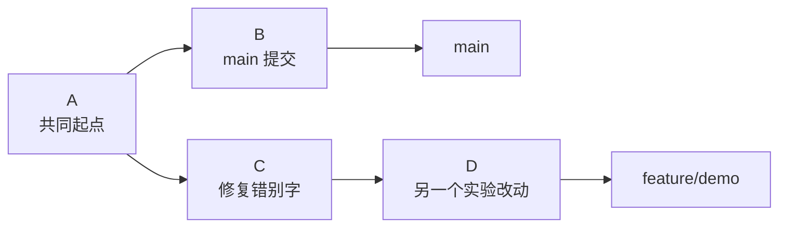
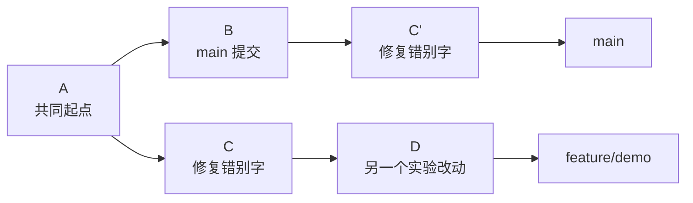

# Day 25：cherry-pick

## 学习目标

学会把另一个分支上的某一次提交，单独拿到当前分支。

## 核心概念

`cherry-pick` 的意思是“摘樱桃”：不是把整个分支合过来，而是只挑某一个提交。

例如现在有两个分支：



如果你只想把 `C` 这个修复拿到 `main`，但不想要 `D`，就可以在 `main` 上执行：

```bash
git cherry-pick C
```

结果类似：



注意：`C'` 是新提交，不是原来的 `C`。它的改动一样，但 commit id 会变。

## 什么时候用 cherry-pick

适合：

- 某个 bug 修复在别的分支上，但当前分支也急需
- 只想拿一个提交，不想合并整个分支
- 把 hotfix 同步到多个版本分支
- 从实验分支里挑一个确定有用的改动

不适合：

- 你其实想合并整个分支
- 一个功能由很多互相依赖的提交组成
- 你不确定这个提交是否依赖前面的提交

## 常用命令

先切到目标分支：

```bash
git switch main
```

找到要拿的提交：

```bash
git log --oneline feature/demo
```

执行 cherry-pick：

```bash
git cherry-pick <commit-id>
```

查看结果：

```bash
git log --oneline --decorate -5
```

## cherry-pick 多个提交

如果要拿多个不连续提交：

```bash
git cherry-pick <commit-a> <commit-b>
```

如果要拿一段连续提交：

```bash
git cherry-pick <start-commit>^..<end-commit>
```

这里的 `^` 表示包含起点提交。

新手如果不熟悉范围写法，可以先一个一个 cherry-pick，更容易看清发生了什么。

## 发生冲突怎么办

cherry-pick 本质上是在当前分支重新应用某次提交，所以也可能冲突。

冲突时：

```bash
git status
# 手动解决冲突文件
git add <file>
git cherry-pick --continue
```

如果不想继续：

```bash
git cherry-pick --abort
```

如果当前这个提交不想要了：

```bash
git cherry-pick --skip
```

`--skip` 要谨慎，它会跳过正在应用的这个提交。

## cherry-pick 和 merge 的区别

| 对比 | cherry-pick | merge |
|---|---|---|
| 拿什么 | 某一个或几个提交 | 整个分支的改动 |
| 历史形态 | 会生成新提交 | 通常保留分支合并关系 |
| 适合场景 | 挑单个修复 | 合并完整功能 |

可以这样判断：

- 只要一个修复：`cherry-pick`
- 要整个功能分支：`merge`

## 今日练习

1. 创建一个分支：

```bash
git switch -c feature/cherry-demo
```

2. 修改一个文件并提交：

```bash
git add <file>
git commit -m "docs: add cherry-pick demo note"
```

3. 记下 commit id：

```bash
git log --oneline -1
```

4. 切回 main：

```bash
git switch main
```

5. 把刚才那个提交拿过来：

```bash
git cherry-pick <commit-id>
```

6. 用日志确认：

```bash
git log --oneline --graph --decorate -5
```

## 检查点

你应该知道：

- `cherry-pick` 拿的是提交里的改动，不是整个分支
- cherry-pick 后会生成新的 commit id
- 冲突时用 `git cherry-pick --continue`
- 放弃时用 `git cherry-pick --abort`
- 如果要完整合并一个分支，通常应该用 `merge`
