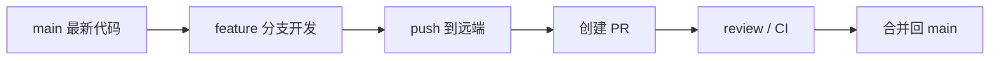

# Day 26：Pull Request 工作流

## 学习目标

理解团队为什么要用 Pull Request，以及一次完整 PR 从创建分支到合并大概经历哪些步骤。

## 核心概念

Pull Request，常简称 PR，是把你的分支改动提交给团队评审的流程。

它不只是一个“合并按钮”，而是把这些事情放到同一个地方：

- 这次改了哪些文件
- 为什么要改
- 谁 review 过
- 自动检查是否通过
- 最后如何合并进主分支

## 一次常见 PR 流程

```text
更新 main
  -> 创建 feature 分支
  -> 提交代码
  -> 推送分支
  -> 创建 Pull Request
  -> 等待检查和 review
  -> 根据意见修改
  -> 合并回 main
```

图示：



## 本地操作步骤

先确保 main 是最新的：

```bash
git switch main
git pull origin main
```

创建功能分支：

```bash
git switch -c feature/update-docs
```

修改文件后提交：

```bash
git status
git add docs/days/day26.md
git commit -m "docs: explain pull request workflow"
```

推送分支：

```bash
git push -u origin feature/update-docs
```

然后到 GitHub 或 GitLab 页面创建 Pull Request。

## PR 描述应该写什么

一个清楚的 PR 描述至少回答三件事：

```text
## 做了什么
- 补充 Day 26 PR 工作流说明
- 增加本地命令和 review 流程

## 为什么
- 原文偏短，新手不知道 PR 每一步在做什么

## 怎么验证
- 阅读 Markdown
- 检查链接和命令格式
```

不要只写：

```text
update
```

别人看不出你想解决什么问题。

## review 意见怎么处理

收到 review 意见后，一般有三种处理方式：

| 情况 | 做法 |
|---|---|
| 对方说得对 | 修改后再提交 |
| 你不确定 | 回复说明你的疑问 |
| 你不同意 | 解释原因，给出依据 |

修改后继续提交到同一个分支：

```bash
git add <file>
git commit -m "docs: address pull request review"
git push
```

PR 会自动更新，不需要重新创建。

## 合并方式怎么选

不同团队有不同习惯，常见有三种：

| 方式 | 特点 |
|---|---|
| Merge commit | 保留完整分支合并历史 |
| Squash merge | 把 PR 里的多个提交压成一个 |
| Rebase merge | 保持 main 历史线性 |

新手先记住：

- 小项目可以用 squash merge，让 main 历史更干净
- 想保留完整分支过程，可以用 merge commit
- 团队已有规范时，按团队规范来

## PR 前自查清单

创建 PR 前先问自己：

- 我是从最新 main 创建的分支吗？
- 本次改动是否只解决一个主题？
- 有没有把临时文件、密钥、无关文件提交进去？
- 提交信息是否能看懂？
- 文档、测试或截图是否需要补充？
- 本地是否已经运行过必要检查？

## 今日练习

1. 从最新 main 创建分支：

```bash
git switch main
git pull origin main
git switch -c feature/pr-practice
```

2. 修改一个文档文件。
3. 提交并推送：

```bash
git add <file>
git commit -m "docs: practice pull request workflow"
git push -u origin feature/pr-practice
```

4. 在网页上创建 Pull Request。
5. 写清楚“做了什么 / 为什么 / 怎么验证”。

## 检查点

你应该知道：

- PR 是代码评审和协作流程，不只是合并按钮
- PR 创建前应该从最新 main 建分支
- review 修改继续推到同一个分支即可
- PR 描述要说明改动、原因和验证方式
