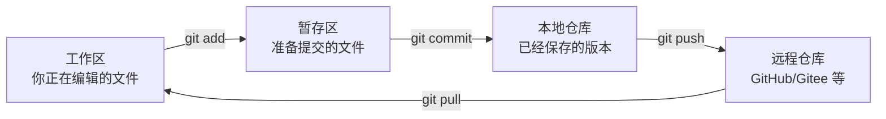
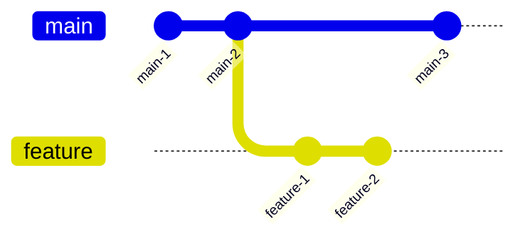
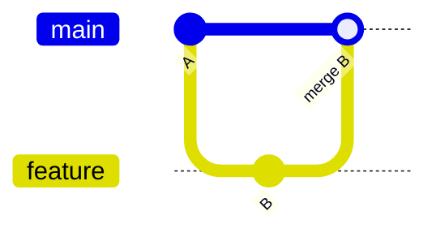
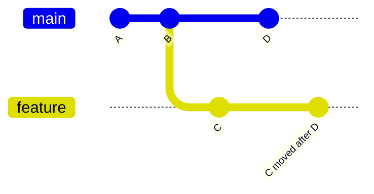
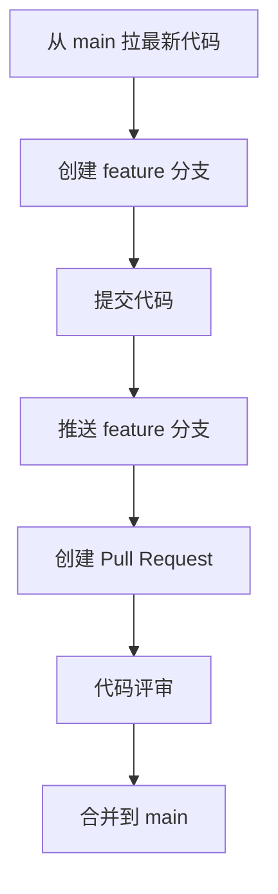

# 30 天 Git 学习路线

这份教程尽量用通俗例子解释 Git。你可以把 Git 想成一个“代码时间机器”：每次 `commit` 就是在当前时间点拍一张照片，以后可以查看、比较、回到某个版本，也可以和别人一起合并各自的照片。

## 开始前准备

检查 Git 是否安装：

```bash
git --version
```

配置用户名和邮箱：

```bash
git config --global user.name "你的名字"
git config --global user.email "your_email@example.com"
```

创建练习目录：

```bash
mkdir my-git-practice
cd my-git-practice
```

Git 的基本工作区可以理解成三层：



---

## 第 1 天：认识 Git 和版本控制

**今天目标：**知道 Git 解决什么问题。

没有 Git 时，你可能会这样保存文件：

```text
毕业论文.doc
毕业论文-修改版.doc
毕业论文-最终版.doc
毕业论文-最终真的版.doc
```

Git 做的事就是：帮你记录每一次修改，并且能清楚知道“谁、在什么时候、改了什么、为什么改”。

常用命令：

```bash
git --version
git help
```

练习：

1. 安装 Git。
2. 查看 Git 版本。
3. 用一句话写下你理解的 Git 是什么。

---

## 第 2 天：初始化仓库

**今天目标：**把一个普通文件夹变成 Git 仓库。

命令：

```bash
git init
```

示例：

```bash
mkdir my-git-practice
cd my-git-practice
git init
```

执行后，目录里会多一个隐藏文件夹 `.git`。它就是 Git 保存版本信息的地方。

练习：

1. 创建 `README.md`。
2. 写入一句话：`这是我的 Git 练习仓库`。
3. 运行 `git status` 查看状态。

---

## 第 3 天：理解工作区和暂存区

**今天目标：**理解为什么提交前要先 `git add`。

Git 不会自动把所有修改都保存进版本历史。你需要先把想提交的文件放进暂存区。

命令：

```bash
git status
git add README.md
```

例子：

```bash
git status
git add README.md
git status
```

你会看到文件状态从未跟踪变成准备提交。

练习：

1. 新建 `notes/day03.md`。
2. 写 3 条今天学到的内容。
3. 用 `git add notes/day03.md` 加入暂存区。

---

## 第 4 天：第一次提交

**今天目标：**完成第一次 `commit`。

提交就是给当前版本拍照。

命令：

```bash
git commit -m "add project readme"
```

一次完整流程：

```bash
git add README.md
git commit -m "add project readme"
```

提交信息建议写清楚“做了什么”，不要只写 `update`。

练习：

1. 提交 `README.md`。
2. 提交信息使用英文动词开头，例如 `add readme`。
3. 运行 `git log` 查看提交记录。

---

## 第 5 天：查看历史记录

**今天目标：**学会查看过去提交。

命令：

```bash
git log
git log --oneline
```

`git log --oneline` 更适合日常查看：

```text
a1b2c3d add project readme
```

前面的短字符串是 commit id，可以理解成这个版本的编号。

练习：

1. 修改 `README.md`。
2. 再提交一次。
3. 使用 `git log --oneline` 查看两次提交。

---

## 第 6 天：查看具体修改

**今天目标：**知道文件到底改了什么。

命令：

```bash
git diff
git diff --staged
```

区别：

- `git diff`：看工作区中还没 `add` 的修改。
- `git diff --staged`：看已经 `add`，但还没 `commit` 的修改。

练习：

1. 修改 `README.md`。
2. 运行 `git diff`。
3. `git add README.md`。
4. 运行 `git diff --staged`。

---

## 第 7 天：忽略不需要提交的文件

**今天目标：**使用 `.gitignore`。

有些文件不应该提交，例如日志、编译产物、临时文件。

创建 `.gitignore`：

```text
*.log
build/
.env
```

示例：

```bash
touch app.log
git status
```

如果 `.gitignore` 配置正确，`app.log` 不会出现在待提交列表中。

练习：

1. 创建 `.gitignore`。
2. 忽略 `*.log`。
3. 创建 `debug.log` 并确认它没有被 Git 跟踪。

---

## 第 8 天：创建分支

**今天目标：**理解分支是什么。

分支可以理解成一条独立开发线。你可以在分支上试验新功能，不影响主线。



命令：

```bash
git branch
git branch feature/login
git switch feature/login
```

练习：

1. 创建 `feature/notes` 分支。
2. 切换到这个分支。
3. 新增 `notes/branch.md` 并提交。

---

## 第 9 天：切换分支

**今天目标：**熟练使用 `git switch`。

命令：

```bash
git switch main
git switch feature/notes
git switch -c feature/readme
```

`git switch -c` 表示创建并切换。

练习：

1. 切回 `main`。
2. 查看 `feature/notes` 分支上的文件是否还在。
3. 再切回 `feature/notes` 对比变化。

---

## 第 10 天：合并分支

**今天目标：**把分支成果合并回主线。

命令：

```bash
git switch main
git merge feature/notes
```

示意图：



练习：

1. 在 `feature/notes` 分支提交一个文件。
2. 切回 `main`。
3. 合并 `feature/notes`。

---

## 第 11 天：解决冲突

**今天目标：**知道冲突为什么出现，怎么解决。

冲突通常发生在两条分支改了同一个文件的同一段内容。

冲突文件可能长这样：

```text
<<<<<<< HEAD
这是 main 分支的内容
=======
这是 feature 分支的内容
>>>>>>> feature/demo
```

解决方式：

1. 打开文件。
2. 手动保留正确内容。
3. 删除冲突标记。
4. `git add`。
5. `git commit`。

练习：

1. 在两个分支分别修改 `README.md` 同一行。
2. 尝试合并制造冲突。
3. 手动解决冲突并提交。

---

## 第 12 天：连接远程仓库

**今天目标：**理解 GitHub 上的远程仓库。

查看远程地址：

```bash
git remote -v
```

添加远程地址：

```bash
git remote add origin https://github.com/your-name/your-repo.git
```

远程仓库可以理解成团队共享的代码仓库。

练习：

1. 在 GitHub 创建一个空仓库。
2. 用 `git remote add origin` 关联。
3. 用 `git remote -v` 检查。

---

## 第 13 天：推送代码

**今天目标：**把本地提交上传到远程。

命令：

```bash
git push -u origin main
```

之后可以简写：

```bash
git push
```

`-u` 的作用是建立本地分支和远程分支的默认关联。

练习：

1. 提交一次本地修改。
2. 推送到 GitHub。
3. 打开网页确认代码已经上传。

---

## 第 14 天：拉取远程更新

**今天目标：**获取别人提交的代码。

命令：

```bash
git pull
```

它大致等于：

```bash
git fetch
git merge
```

练习：

1. 在 GitHub 网页修改 `README.md`。
2. 本地运行 `git pull`。
3. 查看本地文件是否同步。

---

## 第 15 天：克隆仓库

**今天目标：**从远程复制一个项目到本地。

命令：

```bash
git clone https://github.com/your-name/your-repo.git
```

克隆后会自动带上远程地址 `origin`。

练习：

1. 新建一个目录。
2. 克隆自己的练习仓库。
3. 运行 `git remote -v` 查看远程地址。

---

## 第 16 天：撤销工作区修改

**今天目标：**丢弃还没暂存的修改。

命令：

```bash
git restore README.md
```

注意：这会丢弃文件当前未暂存的修改，执行前要确认不需要这些内容。

练习：

1. 随便修改 `README.md`。
2. 运行 `git diff` 看修改。
3. 用 `git restore README.md` 恢复。

---

## 第 17 天：撤销暂存

**今天目标：**把已经 `add` 的文件从暂存区拿回来。

命令：

```bash
git restore --staged README.md
```

它不会删除你的修改，只是取消“准备提交”的状态。

练习：

1. 修改 `README.md`。
2. 执行 `git add README.md`。
3. 执行 `git restore --staged README.md`。
4. 用 `git status` 观察变化。

---

## 第 18 天：修改最后一次提交

**今天目标：**用 `amend` 修补最近一次提交。

场景：刚提交完，发现漏了一个文件或提交信息写错了。

命令：

```bash
git commit --amend
```

如果只想改提交信息：

```bash
git commit --amend -m "better commit message"
```

练习：

1. 提交一个文件。
2. 再修改一点内容。
3. `git add` 后用 `git commit --amend` 合并到上一次提交。

---

## 第 19 天：回退提交

**今天目标：**理解 `revert` 和 `reset` 的区别。

推荐新手优先使用：

```bash
git revert <commit-id>
```

`revert` 会新增一个提交，用来撤销旧提交的影响，历史记录仍然完整。

`reset` 会移动分支指针，可能改写历史，团队协作中要谨慎。

练习：

1. 新增一个错误提交。
2. 用 `git log --oneline` 找到 commit id。
3. 用 `git revert` 撤销它。

---

## 第 20 天：保存临时修改

**今天目标：**使用 `git stash`。

场景：你正在写一半，突然要切分支修 bug，但当前修改还不能提交。

命令：

```bash
git stash
git stash list
git stash pop
```

练习：

1. 修改一个文件但不提交。
2. 执行 `git stash`。
3. 切换分支。
4. 再执行 `git stash pop` 恢复修改。

---

## 第 21 天：标签 tag

**今天目标：**给重要版本打标签。

标签常用于发布版本，例如 `v1.0.0`。

命令：

```bash
git tag v1.0.0
git tag
git push origin v1.0.0
```

练习：

1. 给当前提交打 `v0.1.0` 标签。
2. 查看所有标签。
3. 推送标签到远程。

---

## 第 22 天：理解 HEAD

**今天目标：**知道 `HEAD` 指向哪里。

`HEAD` 可以理解成“你当前所在的位置”。通常它指向当前分支的最新提交。

查看：

```bash
git log --oneline --decorate
```

你可能看到：

```text
abc1234 (HEAD -> main, origin/main) update readme
```

这表示你现在在 `main` 分支的最新提交上。

练习：

1. 查看当前 `HEAD`。
2. 切换分支后再次查看。
3. 对比输出变化。

---

## 第 23 天：rebase 入门

**今天目标：**理解 rebase 的用途。

`merge` 像是把两条线汇合；`rebase` 像是把你的提交挪到最新主线后面。



命令：

```bash
git switch feature/demo
git rebase main
```

练习：

1. 创建一个 feature 分支。
2. main 分支也新增提交。
3. 在 feature 分支上执行 `git rebase main`。

---

## 第 24 天：整理提交记录

**今天目标：**了解交互式 rebase。

命令：

```bash
git rebase -i HEAD~3
```

常见操作：

- `pick`：保留提交。
- `reword`：修改提交信息。
- `squash`：合并到上一个提交。

注意：不要随意整理已经推送并被别人使用的公共分支。

练习：

1. 连续做 3 个小提交。
2. 用交互式 rebase 把它们合成 1 个提交。

---

## 第 25 天：cherry-pick

**今天目标：**把某个提交单独拿过来。

命令：

```bash
git cherry-pick <commit-id>
```

场景：某个 bug 修复在 `dev` 分支上，但你只想把这个修复拿到 `main`。

练习：

1. 在一个分支提交一个小修复。
2. 切换到另一个分支。
3. 用 `cherry-pick` 把这个提交拿过来。

---

## 第 26 天：Pull Request 工作流

**今天目标：**理解团队如何审核代码。

常见流程：



练习：

1. 创建一个新分支。
2. 推送到 GitHub。
3. 在网页上创建 Pull Request。

---

## 第 27 天：写好提交信息

**今天目标：**让提交历史更容易读。

推荐格式：

```text
type: short description
```

常见 type：

- `feat`：新功能
- `fix`：修复 bug
- `docs`：文档
- `refactor`：重构
- `test`：测试
- `chore`：杂项

示例：

```bash
git commit -m "docs: add git branch guide"
git commit -m "fix: correct login validation"
```

练习：

1. 修改文档并用 `docs:` 开头提交。
2. 新增一个示例文件并用 `feat:` 开头提交。

---

## 第 28 天：常见协作规范

**今天目标：**知道团队项目中的基本规则。

常见规范：

- `main` 分支保持稳定。
- 新功能从 `feature/*` 分支开发。
- 修复线上问题用 `hotfix/*` 分支。
- 合并前先拉取最新代码。
- 不把密钥、密码、`.env` 文件提交到仓库。

分支命名示例：

```text
feature/user-login
fix/readme-typo
hotfix/payment-error
docs/git-guide
```

练习：

1. 创建一个符合规范的分支。
2. 提交一次修改。
3. 推送这个分支。

---

## 第 29 天：排查问题

**今天目标：**学会用 Git 找问题。

常用命令：

```bash
git blame README.md
git show <commit-id>
git log -- README.md
```

解释：

- `git blame`：看每一行是谁最后改的。
- `git show`：看某次提交的详细内容。
- `git log -- 文件名`：看某个文件的历史。

练习：

1. 对 `README.md` 执行 `git blame`。
2. 找一个 commit id。
3. 用 `git show` 查看它改了什么。

---

## 第 30 天：综合实战

**今天目标：**完成一次真实 Git 协作流程。

任务：

1. 从 `main` 拉取最新代码。
2. 创建 `feature/final-practice` 分支。
3. 新增 `notes/final-practice.md`。
4. 写下你 30 天学到的 5 个 Git 知识点。
5. 提交代码。
6. 推送分支。
7. 创建 Pull Request。
8. 合并回 `main`。

完整命令参考：

```bash
git switch main
git pull
git switch -c feature/final-practice
mkdir -p notes
echo "# Final Practice" > notes/final-practice.md
git add notes/final-practice.md
git commit -m "docs: add final practice notes"
git push -u origin feature/final-practice
```

完成后，你应该已经掌握：

- 初始化仓库
- 添加和提交文件
- 查看历史和差异
- 使用分支
- 合并和解决冲突
- 连接远程仓库
- 推送和拉取代码
- 撤销错误修改
- 使用 tag、stash、rebase、cherry-pick
- 理解 Pull Request 协作流程

---

## 常用命令速查

| 场景 | 命令 |
|---|---|
| 查看状态 | `git status` |
| 添加文件 | `git add <file>` |
| 提交 | `git commit -m "message"` |
| 查看历史 | `git log --oneline` |
| 查看差异 | `git diff` |
| 创建并切换分支 | `git switch -c <branch>` |
| 切换分支 | `git switch <branch>` |
| 合并分支 | `git merge <branch>` |
| 拉取远程 | `git pull` |
| 推送远程 | `git push` |
| 临时保存修改 | `git stash` |
| 恢复临时修改 | `git stash pop` |
| 撤销工作区修改 | `git restore <file>` |
| 取消暂存 | `git restore --staged <file>` |

## 学完后的建议

接下来可以继续学习：

- GitHub Actions 自动化
- Conventional Commits 规范
- Git Flow / Trunk Based Development
- 代码评审规范
- 开源项目协作流程
