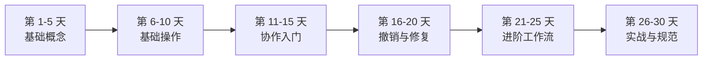

# 30 天 Git 学习路线

这是一份总入口。完整的每天内容已经拆成独立文档，集中在 [30 天每日学习目录](days/README.md)。

如果你只看到 1-5 天，那是 [1-5 天基础概念速览](git-basics-day1-5.md)，不是完整课程。

## 怎么学

1. 先看每日目录。
2. 按天阅读对应文档。
3. 每天跟着命令做一次提交。

## 路线图



## 每日目录

- 第 1-5 天：基础概念
  - [Day 01：认识 Git 和版本控制](days/day01.md)
  - [Day 02：初始化仓库](days/day02.md)
  - [Day 03：工作区和暂存区](days/day03.md)
  - [Day 04：第一次提交](days/day04.md)
  - [Day 05：查看历史记录](days/day05.md)
- 第 6-10 天：基础操作
  - [Day 06：查看具体修改](days/day06.md)
  - [Day 07：忽略不需要提交的文件](days/day07.md)
  - [Day 08：创建分支](days/day08.md)
  - [Day 09：切换分支](days/day09.md)
  - [Day 10：合并分支](days/day10.md)
- 第 11-15 天：协作入门
  - [Day 11：解决冲突](days/day11.md)
  - [Day 12：连接远程仓库](days/day12.md)
  - [Day 13：推送代码](days/day13.md)
  - [Day 14：拉取远程更新](days/day14.md)
  - [Day 15：克隆仓库](days/day15.md)
- 第 16-20 天：撤销与修复
  - [Day 16：撤销工作区修改](days/day16.md)
  - [Day 17：取消暂存](days/day17.md)
  - [Day 18：修改最后一次提交](days/day18.md)
  - [Day 19：回退提交](days/day19.md)
  - [Day 20：临时保存修改](days/day20.md)
- 第 21-25 天：进阶工作流
  - [Day 21：使用标签](days/day21.md)
  - [Day 22：理解 HEAD](days/day22.md)
  - [Day 23：rebase 深入理解](days/day23.md)
  - [Day 24：整理提交记录实战](days/day24.md)
  - [Day 25：cherry-pick](days/day25.md)
- 第 26-30 天：实战与规范
  - [Day 26：Pull Request 工作流](days/day26.md)
  - [Day 27：写好提交信息](days/day27.md)
  - [Day 28：常见协作规范](days/day28.md)
  - [Day 29：排查问题](days/day29.md)
  - [Day 30：综合实战](days/day30.md)

## 基础准备

安装 Git 后，先配置身份：

```bash
git config --global user.name "你的名字"
git config --global user.email "你的邮箱"
```

检查配置：

```bash
git config --global --list
```
